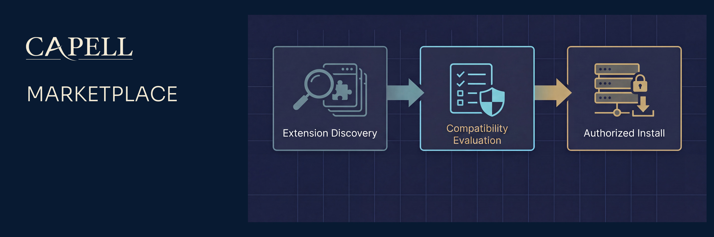

# Capell Marketplace



[](https://github.com/capell-app/marketplace/releases/latest)
[](https://packagist.org/packages/capell-app/marketplace)
[](https://github.com/capell-app/capell/actions/workflows/test-full.yml)
[](https://github.com/capell-app/capell/actions/workflows/code-quality-and-styling.yml)
[](#requirements-and-support-policy)
[](https://packagist.org/packages/capell-app/marketplace)
[](https://docs.capell.app)

`capell-app/marketplace` connects a Capell installation to the Capell extension marketplace. It owns catalogue browsing, Capell account linking, heartbeat/update advisory state, account-based Marketplace install eligibility decisions, queued local Composer install operations, free-install telemetry, and signed install/upgrade authorization records for protected extensions.

Use this package when an admin needs to discover, authorize, or maintain extensions from the Capell marketplace. Local enable, disable, uninstall, and bulk extension management remain part of the installed Extensions surface.

## Package Boundary

Marketplace owns:

- the Extensions-page Marketplace action, extension browser, extension detail flow, account connection action, heartbeat action, and install attempt ledger
- signed Marketplace client requests, account connection callbacks, catalogue caching, heartbeat snapshots, update notices, advisory dismissals, registration sessions, install attempts, queued local Composer operations, and queued free-install telemetry
- Marketplace permissions for viewing extension and Marketplace surfaces

Marketplace does not own:

- Core package registry internals or generic package cache behavior
- Admin's installed Extensions table and local extension management actions
- production deployment completion after a Composer change has been published by Deployments
- public frontend rendering or theme output

## Install

```bash
composer require capell-app/marketplace
```

The package is enabled by default. Main config values:

| Env var                                   | Purpose                                                              |
| ----------------------------------------- | -------------------------------------------------------------------- |
| `CAPELL_MARKETPLACE_ENABLED`              | Enable Marketplace integration.                                      |
| `CAPELL_INSTANCE_ID`                      | Existing Marketplace instance ID fallback.                           |
| `CAPELL_MARKETPLACE_URL`                  | Marketplace API base URL. Defaults to `https://capell.app/api/v1`.   |
| `CAPELL_MARKETPLACE_WEB_URL`              | Public web URL for purchase and account flows.                       |
| `CAPELL_MARKETPLACE_CATALOGUE_PAGE_LIMIT` | Maximum catalogue pages fetched for the browser listing.             |
| `CAPELL_MARKETPLACE_WEBHOOK_URL`          | Public callback URL used by Capell App when `APP_URL` is not enough. |
| `CAPELL_MARKETPLACE_WEBHOOK_SECRET`       | Fallback signing secret for configured instances.                    |
| `CAPELL_MARKETPLACE_TROUBLESHOOTING_URL`  | Help URL shown from Marketplace heartbeat failures.                  |

Only override `CAPELL_MARKETPLACE_URL` for staging or self-hosted Marketplace APIs. The active public API path is versioned with `/api/v1`.

## Runtime Surfaces

- Provider: `Capell\Marketplace\Providers\MarketplaceServiceProvider`
- Config: `config/capell-marketplace.php`
- Routes: `routes/marketplace.php`
- Marketplace client: `Capell\Marketplace\Services\MarketplaceClient`
- Main Filament surfaces: `MarketplaceExtensionDetailPage`, `MarketplacePackageOperationsPage`, `MarketplaceExtensionsBrowser`, marketplace actions on the installed Extensions page, connection status actions, and the extension health widget
- Admin extenders: `MarketplaceExtensionsPageExtender` tagged as `ExtensionsPageExtender::TAG`; `ThemeMarketplaceHeaderActionExtender` tagged as `ResourceHeaderActionExtender::TAG`
- Header action registry keys: `capell-marketplace.open-marketplace`, `capell-marketplace.connect-account`
- Livewire aliases: `capell-marketplace.marketplace-extensions-browser` and `capell-marketplace::marketplace-extensions-browser`
- Activation binding: `capell.marketplace.activation-verifier`
- Main actions/jobs: `StartMarketplaceAccountConnectionAction`, `CompleteMarketplaceAccountConnectionAction`, `PhoneHomeAction`, `CheckForUpdatesAction`, `InstallMarketplaceExtensionAction`, `CreateExtensionAcquisitionAction`, `QueueMarketplaceInstallAttemptAction`, `RunMarketplaceInstallAttemptJob`, `CancelMarketplaceInstallAttemptAction`, `RecordMarketplaceInstallAttemptAction`, `RecordThemeInstallIntentAction`, `ResolvePendingThemeInstallsAction`, `VerifyMarketplaceSignedActivationAction`

The account connection callback is authenticated under the configured admin path.

## How The Main Flows Work

| Flow                     | Classes                                                                                                                                                    | Notes                                                                                                                                                                                                                                                                                                                              |
| ------------------------ | ---------------------------------------------------------------------------------------------------------------------------------------------------------- | ---------------------------------------------------------------------------------------------------------------------------------------------------------------------------------------------------------------------------------------------------------------------------------------------------------------------------------- |
| Account connection       | `StartMarketplaceAccountConnectionAction`, `CompleteMarketplaceAccountConnectionAction`, `MarketplaceAccountConnectionCallbackController`                  | Creates a short-lived account connection session, redirects the admin to Capell App, validates the returned state/code, requires a verified account email, stores account identity in `marketplace_instances`, returns to Extensions, and opens the Marketplace setup cockpit.                                                     |
| Catalogue browsing       | `MarketplaceClient`, `MarketplaceExtensionsBrowser`, `MarketplaceCatalogueTable`                                                                           | Fetches JSON catalogue pages from `/extensions`, scopes cache keys by query and connection context, hides already installed extensions by default with a ternary installed-status filter, serves stale cache only when the browser explicitly allows it, and keeps multi-extension selections instant in the browser until review. |
| Install authorization    | `InstallMarketplaceExtensionAction`, `MarketplaceInstallEligibilityData`, `CreateExtensionAcquisitionAction`, `MarketplaceInstallActionPresenter`          | Orchestrates install lookup, selected options, eligibility, purchase/blocked handling, attempt recording, theme intent recording, free telemetry, local Composer queueing, notification handoff, and Deployments handoff status.                                                                                                   |
| Package operations       | `QueueMarketplaceInstallAttemptAction`, `RunMarketplaceInstallAttemptJob`, `CancelMarketplaceInstallAttemptAction`, `RetryMarketplaceInstallAttemptAction` | Runs one local Composer operation at a time, records preflight checks and timeline events, classifies failures, exposes the dedicated Package Operations page, and emails Package Operations subscribers when manual attention is needed.                                                                                          |
| Theme install resolution | `RecordThemeInstallIntentAction`, `ResolvePendingThemeInstallsAction`                                                                                      | Records pending theme install choices and resolves them when the Composer package is present.                                                                                                                                                                                                                                      |
| Heartbeat/update checks  | `PhoneHomeAction`, `CheckForUpdatesAction`, `RecordUpdateAdvisorySnapshotAction`                                                                           | Sends installed package snapshots and stores update/advisory results locally.                                                                                                                                                                                                                                                      |

Extension detail pages include a collapsed manual install option for hosts where queued Composer is not appropriate. Revealing it shows the package-specific `composer require` command followed by `php artisan capell:extension-install <composer-name>`.

## Account Trust Flow

Account linking is the trust path for protected extensions. An admin connects a Capell account, approves the connection in Capell App, returns to `/admin/extensions`, and the Extensions page opens the Marketplace setup cockpit for install readiness. Free extensions do not require a connected account.

## Data And Security

Marketplace is schema-owning. Its current tables are `marketplace_instances`, `marketplace_update_advisory_snapshots`, `marketplace_update_notice_dismissals`, `marketplace_account_connection_sessions`, `marketplace_install_flow_sessions`, `marketplace_install_attempts`, the append-only `marketplace_install_attempt_events` timeline, and legacy `marketplace_install_intents`. Older installations may retain legacy domain tables, but this package no longer reads them for install access.

The package stores Marketplace instance IDs and encrypted signing secrets. Authorization requests are signed before they are sent to Capell App. Do not expose instance credentials, signing secrets, or licence keys in public output or unauthenticated admin copy.

Signed authorization proves Marketplace entitlement and request integrity. It does not make a package's runtime code, screenshots, docs, or public/admin output inherently safe. Treat marketplace metadata as remote product data and treat installed extension code as normal executable application code.

Catalogue responses are cached for a short period. The cache is scoped by query and Marketplace account context so connected-account state can affect visible actions without leaking one installation's state to another. The browser also checks local active install attempts so duplicate install actions for the same Composer package are blocked while an operation is queued, running, or cancellation is pending.

Marketplace install operations are tracked in `marketplace_install_attempts`, with detailed timeline rows in `marketplace_install_attempt_events`. Starting an install records the attempt, runs preflight checks, queues `composer require --no-interaction --prefer-dist --with-all-dependencies` only when preflight passes, attempts a Deployments publisher handoff when configured, and records safe output/error excerpts. Failed preflight checks are stored as failed attempts so admins can inspect them.

Active and attention-needed operations are opened from the Extensions page header action, which deep-links to the dedicated Package Operations page and shows a badge while operations exist. Free/local Marketplace installs also redirect there immediately after queueing, with the queued operation selected so the admin can watch progress instead of staying in the Marketplace browser. The dashboard alert stays a compact summary. The Package Operations page owns filtering, operation details, timeline review, retry, cancel, mark resolved, and redacted diagnostic export. Cancelling a queued operation prevents Composer from running; cancelling a running operation lets Composer finish and then skips lifecycle work. Retry creates a new attempt linked to the failed source row, preserving the ledger. Package Operations notifications default to super admins and can be managed through notification preferences.

## Verification

From the split repository root, with development dependencies installed, run Marketplace package tests after changing account connection, catalogue, heartbeat, permission, telemetry, or install authorization behavior:

```bash
vendor/bin/pest tests
```

Run focused action or HTTP tests first when changing a specific flow, for example:

```bash
vendor/bin/pest tests/Feature/Actions/MarketplaceAccountConnectionActionTest.php --configuration=phpunit.xml
vendor/bin/pest tests/Feature/Http/MarketplaceAccountConnectionCallbackControllerTest.php --configuration=phpunit.xml
```

## Requirements And Support Policy

| Surface | Supported versions               |
| ------- | -------------------------------- |
| PHP     | `^8.4`                           |
| Laravel | `^12.41.1` or `^13.0`            |
| Core    | The same release as this package |
| Admin   | The same release as this package |

Each Capell 1.x minor receives security fixes for 24 months from its release date, and the latest 1.x minor is always supported. Upgrade all installed Capell foundation packages together to the same supported release before requesting a fix. See the [Capell security policy](https://github.com/capell-app/capell/security/policy) for vulnerability reporting.

Support covers the dependency ranges above. When an upstream release reaches its own end of life earlier, upgrading that dependency may be required to receive a safe fix.

## Troubleshooting

| Symptom                                               | Check                                                                                                              | Fix                                                                                                                                                                                                                                                                                                                                                  |
| ----------------------------------------------------- | ------------------------------------------------------------------------------------------------------------------ | ---------------------------------------------------------------------------------------------------------------------------------------------------------------------------------------------------------------------------------------------------------------------------------------------------------------------------------------------------- |
| Marketplace API route errors                          | `php artisan config:show capell-marketplace.marketplace.base_url`                                                  | Use `https://capell.app/api/v1` and run `php artisan config:clear`.                                                                                                                                                                                                                                                                                  |
| Connect account fails immediately                     | `php artisan config:show app.url` and the latest `marketplace_account_connection_sessions.last_error`              | Set `APP_URL` to a URL with a host, clear config cache, and retry before the 10-minute session expires.                                                                                                                                                                                                                                              |
| Account callback says the session or state is invalid | Latest row in `marketplace_account_connection_sessions`                                                            | Retry from the same browser tab. Do not reuse old approval URLs after starting a newer connection.                                                                                                                                                                                                                                                   |
| Catalogue loads but install is blocked                | Marketplace detail response `install_eligibility`, authorization response, and connected account state             | Resolve the Marketplace-provided account, email verification, entitlement, purchase, activation, or compatibility requirement, then request authorization again.                                                                                                                                                                                     |
| Install is queued or running for the same package     | Package Operations page or `marketplace_install_attempts.status`                                                   | Wait for completion or cancel from Package Operations.                                                                                                                                                                                                                                                                                               |
| Preflight fails before Composer starts                | Package Operations timeline and `failure_stage = preflight`                                                        | Fix the reported PHP, Composer, writeability, duplicate install, or queue readiness issue, then retry from Package Operations.                                                                                                                                                                                                                       |
| Local Composer install fails or times out             | Package Operations notification, `failure_type`, timeline, `failure_reason`, `output_excerpt`, and `error_excerpt` | Fix the Composer/runtime issue, confirm whether files were partially installed, then retry from Package Operations. If web-triggered Composer is unavailable on the host, run the recorded command in deployment, then run `php artisan package:discover`, `php artisan capell:extension-install <composer-name>`, and `php artisan optimize:clear`. |
| Deployments publishing fails                          | Attempt `deployment.status` and Package Operations notification                                                    | Fix Deployments configuration or publish the Composer change manually; the local Composer install still runs unless the operation is cancelled.                                                                                                                                                                                                      |
| Deployments is not connected                          | Attempt `deployment.status`                                                                                        | No manual action is shown by default; connect Deployments if this installation should publish Composer changes to a deployment source.                                                                                                                                                                                                               |
| Heartbeat/update check fails                          | The `RunMarketplaceHeartbeatAction::run()` failure message or admin notification copy                              | Set `APP_URL` or `CAPELL_MARKETPLACE_WEBHOOK_URL`, confirm an instance exists, and check network access to the API URL.                                                                                                                                                                                                                              |
| Catalogue looks stale                                 | Cache keys beginning `capell-marketplace.marketplace.*`                                                            | Run `php artisan cache:clear` locally, or use the browser refresh action when available.                                                                                                                                                                                                                                                             |
| Marketplace surfaces disappear                        | `CAPELL_MARKETPLACE_ENABLED` and `php artisan optimize:clear`                                                      | Re-enable the package config and clear cached config/routes.                                                                                                                                                                                                                                                                                         |

## Development

Package development and coordinated verification happen in the [capell-app/capell monorepo](https://github.com/capell-app/capell). Split package repositories are release mirrors; use [docs.capell.app](https://docs.capell.app) for cross-package guidance. See the [contribution guide](https://github.com/capell-app/capell/blob/main/CONTRIBUTING.md), [security policy](https://github.com/capell-app/capell/security/policy), and [licence](https://github.com/capell-app/capell/blob/main/LICENSE.md).

## Further Reading

| Page                                     | Covers                                                                         |
| ---------------------------------------- | ------------------------------------------------------------------------------ |
| [Marketplace overview](docs/overview.md) | Marketplace responsibilities, admin flow, account linking, and install access. |

The complete Marketplace operations and package-authoring guides are published at [docs.capell.app](https://docs.capell.app).
