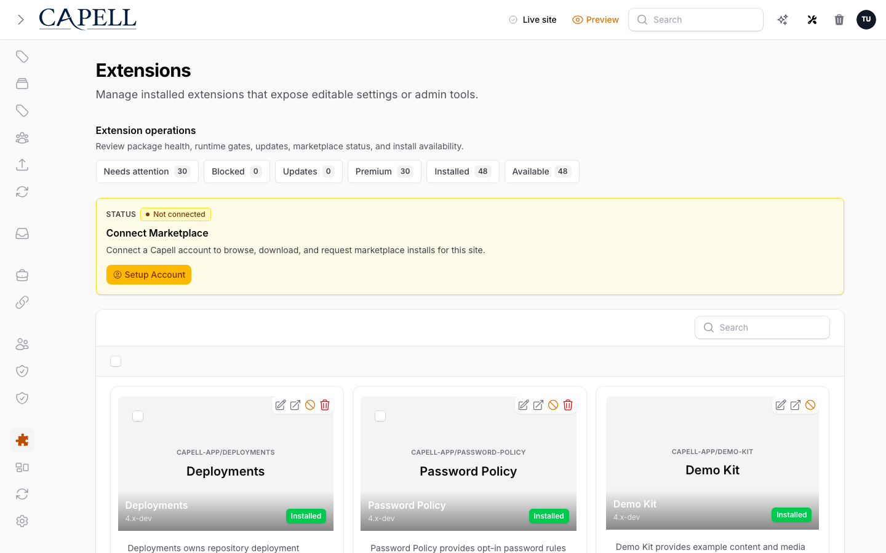
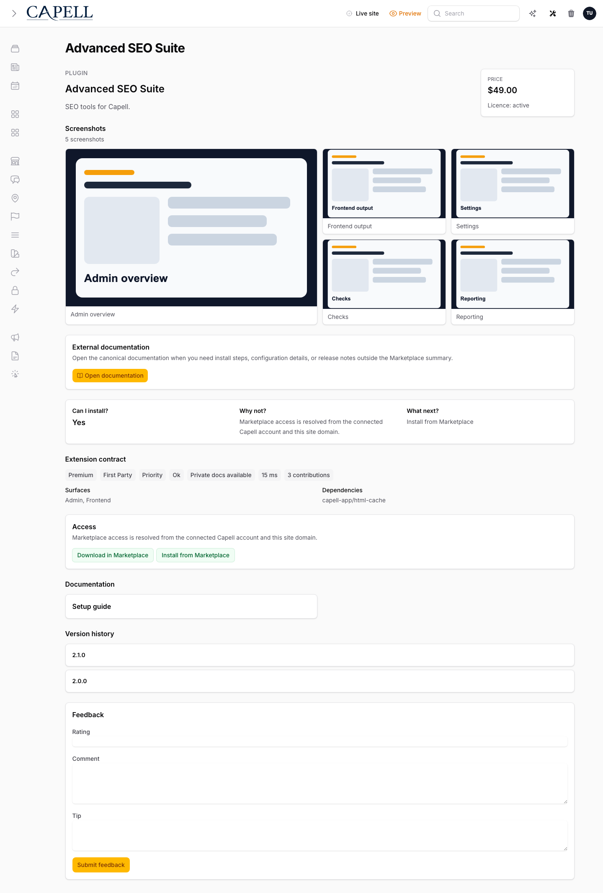

# Capell Marketplace

## What This Package Adds

**Available. Foundation package. Schema-owning. Hidden from Marketplace listings.**

Capell Marketplace connects a Capell installation to the Capell extension marketplace. It provides admin browsing, account connection, hosted install-flow handoff, install authorization, local package operation records, update advisory snapshots, and diagnostic bundles.

After install, admins can browse Marketplace listings from the installed Extensions surface, connect a Capell account, review protected install requirements, queue free installs, complete hosted premium install flows, inspect package operations, retry failed installs, and view update advisories.

Marketplace extends these Capell surfaces:

- Admin extension management through Marketplace actions, detail pages, install review, account connection, update advisories, and package operations.
- Composer package operations through queued install attempts, preflight checks, timeline events, retry records, and optional Deployments handoff.
- Marketplace API integration through catalogue, detail, account connection, install authorization, install-flow exchange, heartbeat, and telemetry requests.
- Site operations through update advisory snapshots, failure classification, cancellation handling, diagnostics, and admin notifications.

## Why It Matters

- **For developers:** Marketplace is the boundary for remote extension state, local install attempts, protected install authorization, package operation history, and Marketplace API contracts. It keeps package installs auditable instead of treating them as anonymous Composer commands.
- **For teams:** Operators can see what was requested, what was authorized, what Composer did, what needs attention, and which update advisories apply to the site.

## Screens And Workflow

Screenshot contract:

- Admin index screen: Marketplace extensions page and Package Operations entry from installed Extensions.
- Create/edit screen: not a content resource. Install review and retry forms are the workflow forms.
- Settings/configuration screen: account connection and heartbeat state are shown in Marketplace/admin surfaces.
- Frontend output: none. Marketplace must not expose account, install, or licence data publicly.
- Package detail or install intent screen: extension detail, hosted install-flow review, manual install guidance, and operation rows.
- Carousel steps: grouped install review, hosted approval redirect, callback exchange, authorization, local queue, and operation timeline.

## Technical Shape

- Service provider: `Capell\Marketplace\Providers\MarketplaceServiceProvider`.
- Config: Marketplace API base URL, callback/webhook URL, package operation settings, cache settings, and account connection settings.
- Migrations and models: Marketplace owns instance, connection, hosted flow, install attempt, attempt event, install intent, advisory snapshot, and dismissal tables.
- Filament pages: extension detail, package operations, update advisory/admin surfaces, and Marketplace browser integration.
- Livewire components: Marketplace extensions browser, install review, operation controls, and account connection UI.
- Routes: authenticated admin callbacks for account connection and hosted install flow.
- Policies/permissions: admin access follows the installed Extensions and Marketplace admin surfaces.
- Events/listeners: package operation events, install attempt events, heartbeat/advisory recording, and notification paths.
- Jobs/queues/schedules: `RunMarketplaceInstallAttemptJob` runs local Composer work under a global lock; telemetry and notification work may queue.
- Blade views/components: admin-only Marketplace pages, operation timelines, diagnostic bundles, and extension detail panels.
- Cache behaviour: catalogue requests are cached under `capell-marketplace.marketplace.*` with query filters and account context.
- Extension hooks: `ExtensionsPageExtender`, resource header action extenders, admin surface contributions, package operation surfaces, and activation verifier binding.

## Data Model

Marketplace owns these tables:

- `marketplace_instances`: connected instance identity, encrypted signing secret, connection mode, account identity, verified email time, metadata, and heartbeat time.
- `marketplace_account_connection_sessions`: short-lived account-link sessions with hashed state/verifier values and callback status.
- `marketplace_install_flow_sessions`: hosted grouped install sessions with selected packages, options, dependency snapshot, hashed return state, encrypted verifier, remote flow ID, status, expiry, and errors.
- `marketplace_install_attempts`: append-only install ledger for eligibility, account context, authorization, deployment handoff, Composer operation state, failure classification, retry links, output excerpts, and telemetry status.
- `marketplace_install_attempt_events`: append-only timeline events for preflight, Composer, package discovery, lifecycle work, notification, cancellation, and failure paths.
- `marketplace_install_intents`: theme/package install intents that resolve after Composer or deployment work.
- `marketplace_update_advisory_snapshots`: last heartbeat/update response stored locally for admin notices.
- `marketplace_update_notice_dismissals`: per-user dismissal state for update and security notices.

Main relationships:

- Install attempts have many attempt events.
- Retry attempts link back to the source attempt through `retry_of_id`.
- Flow sessions store grouped package selections before attempts are queued.
- Advisory dismissals connect update notices to users.

Migration impact:

- Installing Marketplace creates operation, advisory, connection, hosted flow, and install attempt tables.
- Secrets are encrypted or hashed where the model requires it.

Deletion and retention:

- Attempt rows and events are retained as the install audit trail.
- Retry creates a new row rather than mutating the failed source row.
- User-specific advisory dismissals are removed with the user record.

## Install Impact

- Admin navigation: contributes Marketplace actions to installed Extensions, extension detail pages, account connection, update advisories, and Package Operations.
- Permissions: uses admin access to extension and Marketplace surfaces.
- Public routes: none. Callback routes are under the authenticated admin panel path.
- Database changes: creates Marketplace tables for instances, sessions, install attempts, events, install intents, advisories, and dismissals.
- Config keys: API base URL, callback/webhook URL, cache settings, Composer operation settings, and hosted flow options.
- Queues or scheduled tasks: queues local Composer install attempts, telemetry, notification, heartbeat/advisory work, and optional Deployments handoff.
- Cache tags or invalidation paths: Marketplace catalogue cache includes filters and account context; package registry cache is cleared after Composer changes.

## Common Pitfalls

- Protected installs fail closed when Marketplace omits eligibility or account authorization data.
- Free installs do not require a connected account, but telemetry can remain pending if Marketplace is unavailable.
- `APP_URL` or `CAPELL_MARKETPLACE_WEBHOOK_URL` must be public when Marketplace needs callbacks or heartbeat.
- Approval URLs must match the configured Marketplace host before redirecting an admin.
- Composer work needs CLI PHP, Composer, writable Composer files, queue readiness, and package repository access.
- Marketplace/web installs require package lifecycle Actions declared in `capell.json`; legacy install commands alone are not enough.
- Cancelling a running Composer process is best-effort and may leave package files that need manual cleanup.
- Diagnostic bundles must redact secrets, tokens, auth JSON, licence keys, signing secrets, passwords, and environment-like values.

## Quick Start

1. Install the package with `composer require capell-app/marketplace`.
2. Run `php artisan migrate`, clear package/cache state, and configure the Marketplace API URL when using a non-default endpoint.
3. Open installed Extensions, launch Marketplace, connect an account if needed, and verify a catalogue browse or free install flow.

## Next Steps

- Check `php artisan config:show capell-marketplace.marketplace.base_url` when catalogue or authorization calls fail.
- Check `php artisan config:show app.url` and `php artisan config:show capell-marketplace.marketplace.webhook_url` when callbacks or heartbeat fail.
- Inspect Package Operations for failed attempts, timeline events, retry options, and diagnostic bundles.
- Review Marketplace models under `packages/marketplace/src/Models` before changing retention, deletion, or secret handling.
- Review `InstallMarketplaceExtensionAction` before changing Marketplace install orchestration, and review supporting Marketplace Actions and Jobs before changing install authorization, Composer execution, telemetry, heartbeat, or failure classification.
